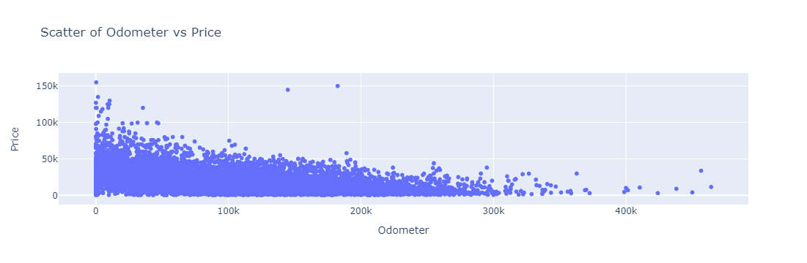
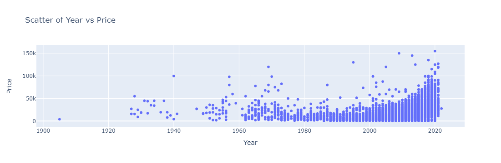
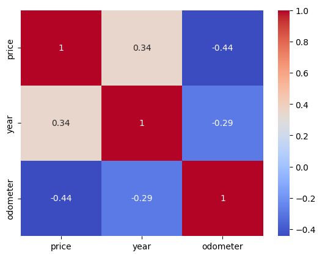
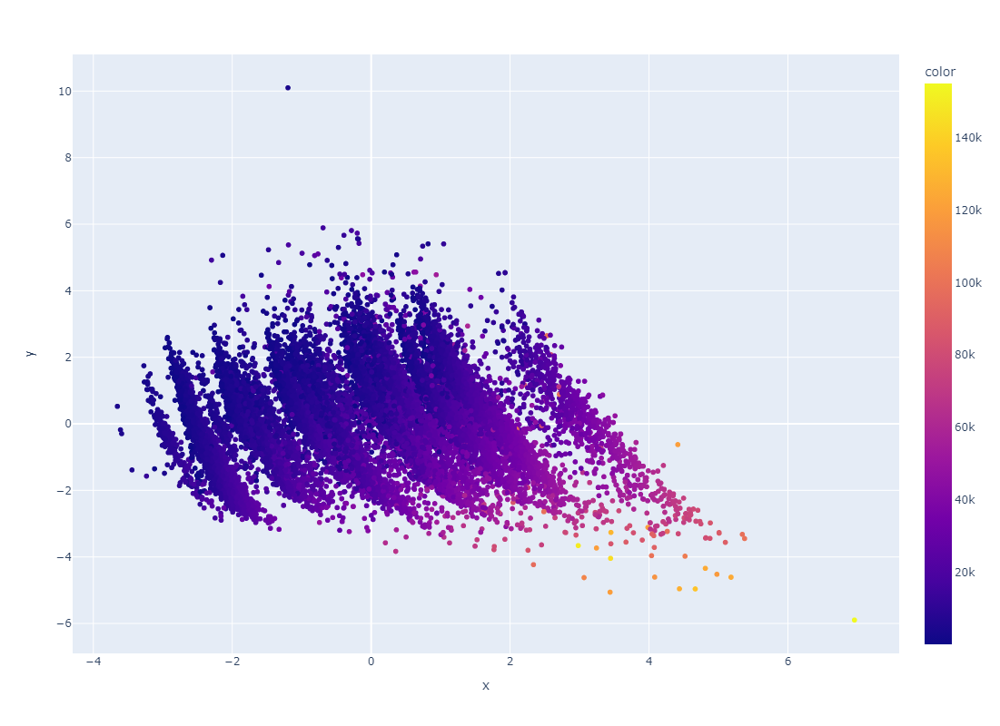
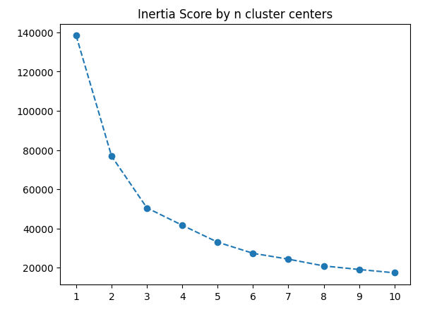
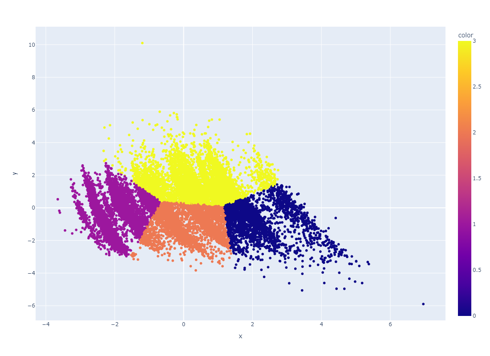

# Assigment 11.1

#### Link to Jupyter notebook file: [Assignment 11.1 Terrence](assignment_Terrence_11_1.ipynb)

## CRISP-DM Framework

### Business Understanding

It could be interesting to try to predict used car prices based on certain attributes. Based on the dataset given, some data questions that can be asked are: Can the price of the car be related to the odometer? Can the price of the car be related to year? Can the price of the car be predicted based on its attributes with resonable accuracy?

### Data Understanding

Steps to start to get to know the dataset: Checking the number of features and rows. Checking for missing data and determine how it can affect the dataset. Checking info, describe and head to get a snapshot of the dataset.

### Data Preparation

After checking data for NA, Year and odometer have minimal entries missing with 0.28% and 1.03% respetively. For the purpose of the questions that is trying to be answerd dropping all NA values should not affect the dataset.

See trend of as odometer goes up, price goes down. For year, the more recent the year of the car, the price goes up. Looking at corelation, there is a positive correlation between year and price, and a negative correlation between odometer and price which is what was expected from looking at the trend.

After using One Hot Encoder and Ordinal Encoder for string categories, upon looking at correlation, some other notable features to look into are:
drive_4wd has high positive correlation
drive_fwd has high negative correlation
size_fullsize has high positive correlation
cylinders has high positive correlation
fuel has high negative correlation

### Modeling

Calculated PCA with 2 components.

Using inertia score determined that 4 clusters was the best for Kmeans.

Used Lasso, Ridge, and RFE model. Refer to Jupyter notebook for more calculations and figures.

### Evaluation

Findings analysis:
Using Lasso model, top four features based on coef are:
- odometer	-5646.544166
- fuel	-4278.261595
- year	3056.502540
- drive_fwd	-2409.524334

Using Ridge Model, top four features based on coef are:
- year	3054.709596
- odometer	-5245.825806
- drive_fwd	-4411.147265
- fuel	-4866.827595

Lasso had mean squared error for training and test sets as 70500925.78192995 and 69385179.60703374 respectively.
Ridge had mean squared error for training and test sets as 77631486.3672506 and 77297563.88485795 respectively.

Both models include the same 4 features of odometer, fuel, year, and specifically forward drive.

### Deployment

Based on evaluation above, a suggested that odometer reading, year the car was made, forward drive, and fuel type are more important factors in what
affects the price of a used car. In turn, that can mean that is what customers are looking into. I used use this to test stocking more cars based on
these findings re-evaluated some time later this year to see if sales have been affected and if any extra analysis can be done.

In the future, subseting the fuel feature like what was done for drive train can be useful in determining what type of fuel car affects the price greater.

*Refer to Jupyter notebook for more calculations and figures.
